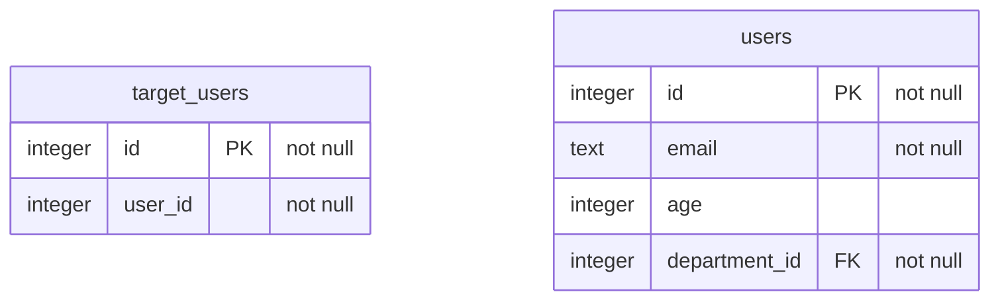

## Example
### public

```mermaid
erDiagram
  target_users {
    integer id PK "not null"
    integer user_id "not null"
  }
  users {
    integer id PK "not null"
    text email "not null"
    integer age
    integer department_id FK "not null"
  }
```