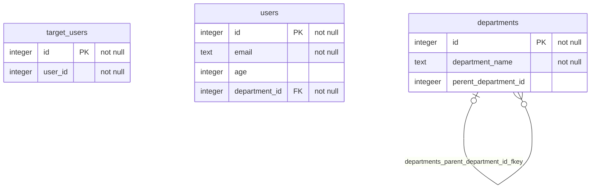

## Example
### public

```mermaid

erDiagram
  target_users {
    integer id PK "not null"
    integer user_id "not null"
  }
  users {
    integer id PK "not null"
    text email "not null"
    integer age
    integer department_id FK "not null"
  }
  departments {
    integer id PK "not null"
    text department_name "not null"
    integeer perent_department_id
  }
  departments o| -- o{ departments : "departments_parent_department_id_fkey"
```